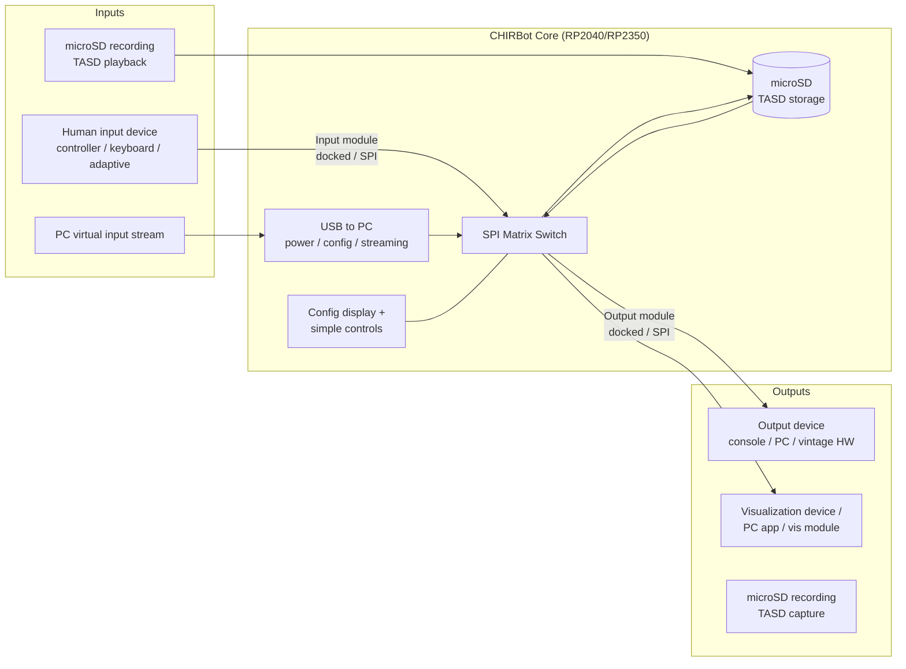

# CHIRBot — Architecture & Repository Structure

> **Status:** Draft — hardware designs are not finalized. The only finalized
> technical decision is the use of the **Raspberry Pi Pico SDK** targeting the
> **RP2040** and/or **RP2350** microcontrollers. Everything else in this
> document is a working proposal subject to revision.

## 1. Project Overview

CHIRBot (Computer-Human Input Relay Bot) is an open source hardware/software
input relay device. It takes input from any supported input device and remaps
it to any supported output device, with tools for input **recording**,
**playback** (macros through full Tool-Assisted Speedruns), and **realtime
visualization**.

Design goals (from [chirbot.com](https://chirbot.com/)):

- Any single input remapped to any output with full recording, playback, and visualization
- CHIRBot core with SPI-based matrix relaying input in ~1 ms regardless of protocol
- Modular design with native, device-specific input/output connectors
- Visualization via built-in display, a visualization output module, or PC app
- USB to PC providing power, matrix configuration, and virtual input streaming
- Simple on-device buttons for recording/playback/settings control
- On-device microSD storage for recordings, exposed to the PC via USB
- Cost targets: < $100 for the core, < $40 per module

## 2. System Architecture

### 2.1 High-level block diagram



### 2.2 Components

| Component | MCU | Role |
|---|---|---|
| **Core** | RP2040/RP2350 (SPI main) | Matrix switch, USB to PC, microSD, display/controls, module power & management |
| **Input module** | RP2040/RP2350 (SPI subnode) | Converts a native input protocol (USB host via PIO, GameCube/N64 3-wire, NES/SNES serial, PS/2, etc.) into TASD-packetized SPI data |
| **Output module** | RP2040/RP2350 (SPI subnode) | Converts TASD-packetized SPI data into a native output protocol; owns the output-device poll edge (clock domain source) |
| **Visualization** | varies | Built-in display, dedicated vis output module, or PC app |
| **Host software** | n/a (PC) | Configuration, virtual input streaming, visualization, replay management |

### 2.3 Key architectural decisions

1. **Pico SDK everywhere (finalized).** All firmware (core and modules) is
   built on the Raspberry Pi Pico SDK with CMake. Code should build for both
   RP2040 and RP2350 where practical (`PICO_BOARD`/`PICO_PLATFORM` switchable).
2. **SPI as the internal transport** *(confirmed — see
   [design/0001](design/0001-module-link-bus-and-connector.md))*. The core is
   the SPI main; modules are subnodes. Target end-to-end relay latency is ~1 ms
   regardless of the native protocols involved.
3. **Board-to-board module docking — no link cables** *(decided — see
   [design/0001](design/0001-module-link-bus-and-connector.md); connector
   family selection pending)*. Modules dock directly onto the core via a
   board-to-board connector carrying SPI plus module power. The only cables
   in a working setup are USB to the PC and the native input/output device
   cables.
4. **TASD as the data format.** The [TASD format](https://tasd.io) is used both
   for packetized input data over SPI and for storage of macros/runs on
   microSD. Encoding/decoding is handled by the
   [Fortinbra/TASD](https://github.com/Fortinbra/TASD) library — a minimal,
   allocation-free C99 implementation compatible with the Pico SDK (note: not
   yet fully tested; see §5). Extensions (e.g., rumble, motion control packet
   types) will be proposed upstream as needed.
5. **Output device owns the clock domain.** The output device generates the
   poll edge (e.g., SNES latch). Inputs may be sampled at ~1 ms, but forwarding
   and recording are aligned to the output device's polling frequency.
6. **Modularity over integration.** Device-specific electrical/physical
   adaptation lives entirely in modules; the core stays protocol-agnostic.

### 2.4 Firmware layering (proposed)

```
┌─────────────────────────────────────────────┐
│ Application (core app / module app)          │
├─────────────────────────────────────────────┤
│ CHIRBot common libraries                     │
│  • TASD encode/decode (Fortinbra/TASD)       │
│  • SPI matrix link protocol (main/subnode)   │
│  • Module discovery / handshake / config     │
├─────────────────────────────────────────────┤
│ Protocol drivers (per module)                │
│  • PIO USB host, NES/SNES serial, GC/N64,    │
│    PS/2, Genesis/Atari, BT radio, ...        │
├─────────────────────────────────────────────┤
│ Pico SDK (RP2040 / RP2350)                   │
└─────────────────────────────────────────────┘
```

Shared code (TASD, SPI link protocol, config/handshake) must be a common
library consumed by core and all module firmware so the wire protocol can never
drift between components. TASD serialization itself is the external
[Fortinbra/TASD](https://github.com/Fortinbra/TASD) library (pure C99,
caller-supplied buffers, no `malloc`, no external dependencies), consumed via
`add_subdirectory` + `target_link_libraries(<target> PRIVATE tasd)`;
`chirbot-common` wraps it with CHIRBot-specific conventions (SPI packetization,
storage layout) rather than reimplementing the format.

## 3. Repository Structure

### 3.1 Strategy: parent repo + per-component repos

This repository (`CHIRBot`) is the **parent/meta repo**. It holds
project-wide documentation, the architecture, shared specifications, and links
(git submodules) to component repositories. Rationale:

- Hardware and firmware for each module will version independently and be
  built/ordered independently (KiCad projects, fab outputs, releases).
- Community members can contribute a single new module without cloning
  everything.
- Shared protocol code lives in one place and is versioned explicitly, so a
  module pins the protocol version it was validated against.

Until hardware stabilizes, new components may start as folders here and be
**promoted to their own repos** when they have real content — avoid creating
empty submodule repos prematurely.

### 3.2 Parent repo layout (this repo)

```
CHIRBot/                          # parent / meta repo
├── README.md                     # project intro, links to all components
├── LICENSE
├── docs/
│   ├── ARCHITECTURE.md           # this document
│   ├── specs/
│   │   ├── spi-matrix-protocol.md    # SPI link: framing, timing, discovery
│   │   ├── module-interface.md       # docking pinout, mechanicals, power, handshake
│   │   ├── tasd-usage.md             # how CHIRBot uses/extends TASD
│   │   └── clock-domains.md          # poll-edge / timing model
│   ├── design/                   # design discussions, decisions (ADRs)
│   └── images/
├── firmware/                     # (submodules once promoted)
│   ├── TASD/                     # submodule → github.com/Fortinbra/TASD
│   ├── chirbot-common/           # shared libs: SPI link, config; wraps TASD
│   ├── chirbot-core/             # core firmware
│   └── modules/
│       ├── input-usb/            # PIO USB host input module
│       ├── input-nes-snes/
│       ├── input-gc-n64/
│       ├── output-usb/
│       ├── output-nes-snes/
│       └── ...                   # one repo/folder per module
├── hardware/                     # (submodules once promoted)
│   ├── chirbot-core-hw/          # KiCad, BOM, fab outputs
│   └── modules/
│       └── ...                   # mirrors firmware/modules naming
├── host/
│   ├── chirbot-app/              # PC configuration / streaming / visualization
│   └── chirbot-cli/              # scripting & CI-friendly tooling
└── tools/                        # project-wide dev tooling, CI helpers
```

### 3.3 Component repo naming convention

| Kind | Pattern | Example |
|---|---|---|
| Core firmware | `chirbot-core` | `chirbot-core` |
| Shared firmware libs | `chirbot-common` | `chirbot-common` |
| Module firmware | `chirbot-module-<dir>-<device>` | `chirbot-module-input-snes` |
| Hardware | `<component>-hw` | `chirbot-core-hw` |
| Host software | `chirbot-<app>` | `chirbot-app` |

Where firmware and hardware for a module are tightly coupled and small, a
single `chirbot-module-<dir>-<device>` repo may contain both `firmware/` and
`hardware/` subfolders.

### 3.4 Standard firmware repo layout

Every firmware repo follows the same Pico SDK/CMake shape:

```
chirbot-<component>/
├── CMakeLists.txt                # pico_sdk_import, PICO_BOARD selectable
├── src/
├── include/
├── lib/                          # chirbot-common, TASD (submodule or FetchContent)
├── test/                         # host-buildable unit tests where possible
├── boards/                       # custom board headers (RP2040/RP2350 variants)
└── README.md
```

## 4. Versioning & Compatibility

- **Protocol versions are explicit.** The SPI matrix protocol and module
  handshake carry a version number; the core reports module compatibility on
  its display and to the PC app.
- **`chirbot-common` is semver-tagged.** Core and modules pin a tagged release.
- **TASD library.** [Fortinbra/TASD](https://github.com/Fortinbra/TASD) is
  consumed as a pinned submodule/tag by `chirbot-common`; it has no releases
  yet, so pin by commit until it is tagged.
- **TASD compliance.** Track the upstream TASD spec; CHIRBot-specific
  extensions are documented in `docs/specs/tasd-usage.md` and proposed
  upstream.

## 5. Open Questions

Tracked here until resolved (then recorded as decisions in `docs/design/`):

- [ ] RP2040 vs RP2350 selection per component (cost vs. capability; RP2350
      security features for USB output spoofing/auth scenarios?)
- [ ] Exact SPI electrical/timing budget to hit the ~1 ms relay target
      (PL022 subnode clock-ratio limit)
- [ ] Docking connector family/part selection and module power budget — see
      [design/0001](design/0001-module-link-bus-and-connector.md) addendum
- [ ] Standard module PCB outline, connector placement, and hot-swap policy
- [ ] Validate the [Fortinbra/TASD](https://github.com/Fortinbra/TASD) library:
      test coverage against the TASD spec and real-world .tasd files, then tag
      a first release
- [ ] TASD extensions needed: rumble, motion control, others
- [ ] Visualization output module design (protocol to vis device)
- [ ] Multi-input (two humans / two outputs) — explicitly out of scope for v1
- [ ] Host app stack selection (cross-platform requirement assumed)
- [ ] License choice for hardware (this repo's LICENSE covers software; hardware
      may need CERN-OHL or similar)

## 6. References

- Project site: <https://chirbot.com/>
- TASD format: <https://tasd.io/>
- TASD C library (ours): <https://github.com/Fortinbra/TASD>
- Pico SDK: <https://github.com/raspberrypi/pico-sdk>
