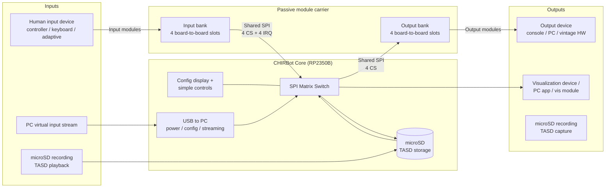

# CHIRBot — Architecture & Repository Structure

> **Status:** Draft — hardware designs are not finalized. Finalized technical
> decisions so far: the **Raspberry Pi Pico SDK** on the **RP2350B** as the
> standard MCU for all active boards
> ([design/0002](design/0002-mcu-selection-rp2350b.md)), SPI as the module link,
> and a passive carrier with board-to-board slots for four input and four
> output modules
> ([design/0003](design/0003-carrier-and-multislot-bus-topology.md)). Everything
> else in this document is a working proposal subject to revision.

## 1. Project Overview

CHIRBot (Computer-Human Input Relay Bot) is an open source hardware/software
input relay device. It takes input from any supported input device and remaps
it to any supported output device, with tools for input **recording**,
**playback** (macros through full Tool-Assisted Speedruns), and **realtime
visualization**.

Design goals (from [chirbot.com](https://chirbot.com/)):

- Any single input remapped to any output with full recording, playback, and visualization
- CHIRBot core with SPI-based matrix relaying input in ~1 ms regardless of protocol
- Modular design with native, device-specific input/output connectors
- Visualization via built-in display, a visualization output module, or PC app
- USB to PC providing power, matrix configuration, and virtual input streaming
- Simple on-device buttons for recording/playback/settings control
- On-device microSD storage for recordings, exposed to the PC via USB
- Cost targets: < $100 for the core, < $40 per module

### 1.1 Terminology

Input events are described with these terms throughout the project. Use them
precisely in documentation, specs, commit messages, and code identifiers.

| Term | Meaning |
| --- | --- |
| **Button press** | A complete press *and* release. Self-contained — no follow-up event is implied. |
| **Button hold** | A press *separated* from its release. Obligates a matching **button release** later. |
| **Button press and hold** | Synonym for **button hold**. |
| **Button release** | The release half of a **button hold**. |

The distinction matters because a **press** is one indivisible action from the
consumer's point of view, while a **hold** leaves the input asserted and the
state machine owing a release. "Press" must never be used to mean "the moment
the button goes down" — that is the start of a **hold**.

## 2. System Architecture

### 2.1 High-level block diagram


```mermaid
flowchart LR
    subgraph Inputs
        HID[Human input device<br/>controller / keyboard / adaptive]
        PC_IN[PC virtual input stream]
        SD_IN[microSD recording<br/>TASD playback]
    end

    subgraph Core["CHIRBot Core (RP2350B)"]
        MATRIX[SPI Matrix Switch]
        DISP[Config display +<br/>simple controls]
        SD[(microSD<br/>TASD storage)]
        USB[USB to PC<br/>power / config / streaming]
    end

      subgraph Carrier["Passive module carrier"]
        IN_BANK[Input bank<br/>4 board-to-board slots]
        OUT_BANK[Output bank<br/>4 board-to-board slots]
      end

    subgraph Outputs
        OUT[Output device<br/>console / PC / vintage HW]
        VIS[Visualization device /<br/>PC app / vis module]
        SD_OUT[microSD recording<br/>TASD capture]
    end

    HID -->|Input modules| IN_BANK
    IN_BANK -->|Shared SPI<br/>4 CS + 4 IRQ| MATRIX
    PC_IN --> USB --> MATRIX
    SD_IN --> SD --> MATRIX
    MATRIX -->|Shared SPI<br/>4 CS| OUT_BANK
    OUT_BANK -->|Output modules| OUT
    MATRIX --> VIS
    MATRIX --> SD
    DISP --- MATRIX
```

### 2.2 Components

| Component | MCU | Role |
|---|---|---|
| **Core** | RP2350B (SPI controller/main) | Sole SPI transaction initiator; matrix switch, USB to PC, microSD, display/controls, module discovery, power, and management |
| **Module carrier** | None (passive) | Connects the core to four input and four output slots; distributes shared buses, per-slot control, power, and ground |
| **Input module** | RP2350B (SPI peripheral/subnode) | Translates one native controller protocol into TASD-packetized SPI data and asserts its data-ready signal when input is pending |
| **Output module** | RP2350B (SPI peripheral/subnode) | Translates TASD-packetized SPI data into one console-native output protocol and services poll edges generated by that console |
| **Visualization** | varies | Built-in display, dedicated vis output module, or PC app |
| **Host software** | n/a (PC) | Configuration, virtual input streaming, visualization, replay management |

### 2.3 Key architectural decisions

1. **Pico SDK everywhere (finalized), on a standard MCU.** All firmware (core
  and modules) is built on the Raspberry Pi Pico SDK with CMake. Every active
  controller or module board uses the **RP2350B** - 48 GPIO, 8 ADC channels,
  12 PIO state machines - as the one-size-fits-all MCU. Passive interconnect
  boards such as the module carrier have no MCU
   ([design/0002](design/0002-mcu-selection-rp2350b.md)).
2. **SPI as the internal transport** *(confirmed — see
  [design/0001](design/0001-module-link-bus-and-connector.md) and
  [design/0003](design/0003-carrier-and-multislot-bus-topology.md))*. The core
  is the SPI controller/main (master); modules are peripherals/subnodes. One
  shared SPI bank serves up to four input slots and a second shared SPI bank
  serves up to four output slots. Each slot has a dedicated chip select, and
  the core initiates every discovery, configuration, input-read, and
  output-write transaction. A module never initiates an SPI transaction.
  Target end-to-end relay latency is ~1 ms regardless of the native protocols
  involved.
3. **Passive module carrier and board-to-board slots - no link cables**
  *(decided - see
  [design/0003](design/0003-carrier-and-multislot-bus-topology.md); connector
  family selection pending)*. The core and up to four input plus four output
  modules connect to a passive carrier. Modules attach through board-to-board
  connectors carrying their bank's SPI signals, slot-specific CS, power,
  ground, and reserved I2C. Input slots also carry a dedicated data-ready IRQ.
  The only external cables in a working setup are USB to the PC and native
  input/output device cables.
4. **TASD as the data format.** The [TASD format](https://tasd.io) is used both
   for packetized input data over SPI and for storage of macros/runs on
   microSD. Encoding/decoding is handled by the
   [Fortinbra/TASD](https://github.com/Fortinbra/TASD) library — a minimal,
   allocation-free C99 implementation compatible with the Pico SDK (note: not
   yet fully tested; see §5). Extensions (e.g., rumble, motion control packet
   types) will be proposed upstream as needed.
5. **Output device owns the clock domain.** The output device generates the
   poll edge (e.g., SNES latch). Inputs may be sampled at ~1 ms, but forwarding
   and recording are aligned to the output device's polling frequency.
6. **Modularity over integration.** Device-specific electrical/physical
   adaptation lives entirely in modules; the core stays protocol-agnostic.
7. **Runtime module discovery.** Every module exposes a descriptor that the
  core queries over SPI. At minimum it identifies the module as input or
  output and reports stable vendor/product identity, hardware and firmware
  revisions, supported link-protocol versions, and protocol-specific
  capabilities. The core uses this descriptor to validate slot compatibility
  and select configuration; it must not infer identity from TASD payloads.
8. **Event-driven input service.** Each input dock provides a dedicated
  module-to-core data-ready/IRQ signal. An input module asserts it while TASD
  data is pending, and the core responds by initiating the SPI read. This
  avoids continuous production polling. The prototype v1 link predates this
  requirement and remains polling-only until its hardware and protocol are
  revised. Output modules do not require data-ready signaling for their normal
  data path because the core initiates output writes.
9. **I2C reserved for future expansion.** The carrier exposes separate 3.3 V
  I2C segments to the four input slots and four output slots. I2C is not used
  for TASD transport or current module discovery and remains disabled until a
  future specification defines addressing, pull-ups, isolation, and recovery.

Modules are intentionally narrow translators. Input modules only acquire one
controller protocol, encode it as TASD, and expose it to the core. Output
modules only receive TASD and produce one console-facing protocol. Routing,
mapping, recording, playback, policy, and cross-module coordination belong to
the core.

### 2.4 Firmware layering (proposed)

```
┌─────────────────────────────────────────────┐
│ Application (core app / module app)          │
├─────────────────────────────────────────────┤
│ CHIRBot common libraries                     │
│  • TASD encode/decode (Fortinbra/TASD)       │
│  • SPI matrix link protocol (main/subnode)   │
│  • Module discovery / handshake / config     │
├─────────────────────────────────────────────┤
│ Protocol drivers (per module)                │
│  • PIO USB host, NES/SNES serial, GC/N64,    │
│    PS/2, Genesis/Atari, BT radio, ...        │
├─────────────────────────────────────────────┤
│ Pico SDK (RP2350B)                           │
└─────────────────────────────────────────────┘
```

Shared code (TASD, SPI link protocol, config/handshake) must be a common
library consumed by core and all module firmware so the wire protocol can never
drift between components. TASD serialization itself is the external
[Fortinbra/TASD](https://github.com/Fortinbra/TASD) library (pure C99,
caller-supplied buffers, no `malloc`, no external dependencies), consumed via
`add_subdirectory` + `target_link_libraries(<target> PRIVATE tasd)`;
`chirbot-common` wraps it with CHIRBot-specific conventions (SPI packetization,
storage layout) rather than reimplementing the format.

## 3. Repository Structure

### 3.1 Strategy: parent repo + per-component repos

This repository (`CHIRBot`) is the **parent/meta repo**. It holds
project-wide documentation, the architecture, shared specifications, and links
(git submodules) to component repositories. Rationale:

- Hardware and firmware for each module will version independently and be
  built/ordered independently (KiCad projects, fab outputs, releases).
- Community members can contribute a single new module without cloning
  everything.
- Shared protocol code lives in one place and is versioned explicitly, so a
  module pins the protocol version it was validated against.

Until hardware stabilizes, new components may start as folders here and be
**promoted to their own repos** when they have real content — avoid creating
empty submodule repos prematurely.

### 3.2 Parent repo layout (this repo)

```
CHIRBot/                          # parent / meta repo
├── README.md                     # project intro, links to all components
├── LICENSE
├── docs/
│   ├── ARCHITECTURE.md           # this document
│   ├── specs/
│   │   ├── spi-matrix-protocol.md    # SPI link: framing, timing, discovery
│   │   ├── module-interface.md       # carrier slots, electrical/mechanical contract
│   │   ├── tasd-usage.md             # how CHIRBot uses/extends TASD
│   │   └── clock-domains.md          # poll-edge / timing model
│   ├── design/                   # design discussions, decisions (ADRs)
│   └── images/
├── firmware/                     # (submodules once promoted)
│   ├── TASD/                     # submodule → github.com/Fortinbra/TASD
│   ├── chirbot-common/           # shared libs: SPI link, config; wraps TASD
│   ├── chirbot-core/             # core firmware
│   └── modules/
│       ├── input-usb/            # PIO USB host input module
│       ├── input-nes-snes/
│       ├── input-gc-n64/
│       ├── output-usb/
│       ├── output-nes-snes/
│       └── ...                   # one repo/folder per module
├── hardware/                     # (submodules once promoted)
│   ├── chirbot-core-hw/          # KiCad, BOM, fab outputs
│   ├── chirbot-carrier-hw/       # passive bus and module-slot carrier
│   └── modules/
│       └── ...                   # mirrors firmware/modules naming
├── host/
│   ├── chirbot-app/              # PC configuration / streaming / visualization
│   └── chirbot-cli/              # scripting & CI-friendly tooling
└── tools/                        # project-wide dev tooling, CI helpers
```

### 3.3 Component repo naming convention

| Kind | Pattern | Example |
|---|---|---|
| Core firmware | `chirbot-core` | `chirbot-core` |
| Shared firmware libs | `chirbot-common` | `chirbot-common` |
| Module firmware | `chirbot-module-<dir>-<device>` | `chirbot-module-input-snes` |
| Hardware | `<component>-hw` | `chirbot-core-hw` |
| Host software | `chirbot-<app>` | `chirbot-app` |

Where firmware and hardware for a module are tightly coupled and small, a
single `chirbot-module-<dir>-<device>` repo may contain both `firmware/` and
`hardware/` subfolders.

### 3.4 Standard firmware repo layout

Every firmware repo follows the same Pico SDK/CMake shape:

```
chirbot-<component>/
├── CMakeLists.txt                # pico_sdk_import, PICO_PLATFORM=rp2350
├── src/
├── include/
├── lib/                          # chirbot-common, TASD (submodule or FetchContent)
├── test/                         # host-buildable unit tests where possible
├── boards/                       # custom RP2350B board headers
└── README.md
```

## 4. Versioning & Compatibility

- **Protocol versions are explicit.** The SPI matrix protocol and module
  handshake carry a version number; the core reports module compatibility on
  its display and to the PC app.
- **`chirbot-common` is semver-tagged.** Core and modules pin a tagged release.
- **TASD library.** [Fortinbra/TASD](https://github.com/Fortinbra/TASD) is
  consumed as a pinned submodule/tag by `chirbot-common`; it has no releases
  yet, so pin by commit until it is tagged.
- **TASD compliance.** Track the upstream TASD spec; CHIRBot-specific
  extensions are documented in `docs/specs/tasd-usage.md` and proposed
  upstream.

## 5. Open Questions

Tracked here until resolved (then recorded as decisions in `docs/design/`):

- [x] ~~RP2040 vs RP2350 selection per component~~ — decided: RP2350B
      everywhere ([design/0002](design/0002-mcu-selection-rp2350b.md))
- [ ] Exact SPI electrical/timing budget to hit the ~1 ms relay target
      (PL022 subnode clock-ratio limit)
- [ ] Carrier and module-slot connector family/part selection and per-slot
  power budget - see
  [design/0003](design/0003-carrier-and-multislot-bus-topology.md)
- [ ] Standard module PCB outline, connector placement, and hot-swap policy
- [ ] Validate the [Fortinbra/TASD](https://github.com/Fortinbra/TASD) library:
      test coverage against the TASD spec and real-world .tasd files, then tag
      a first release
- [ ] TASD extensions needed: rumble, motion control, others
- [ ] Visualization output module design (protocol to vis device)
- [ ] Multi-module routing policy and simultaneous-route limits; the production
  carrier has four input and four output slots, while the bench prototype
  exercises only one input-to-output path
- [ ] Host app stack selection (cross-platform requirement assumed)
- [ ] License choice for hardware (this repo's LICENSE covers software; hardware
      may need CERN-OHL or similar)

## 6. References

- Project site: <https://chirbot.com/>
- TASD format: <https://tasd.io/>
- TASD C library (ours): <https://github.com/Fortinbra/TASD>
- Pico SDK: <https://github.com/raspberrypi/pico-sdk>
